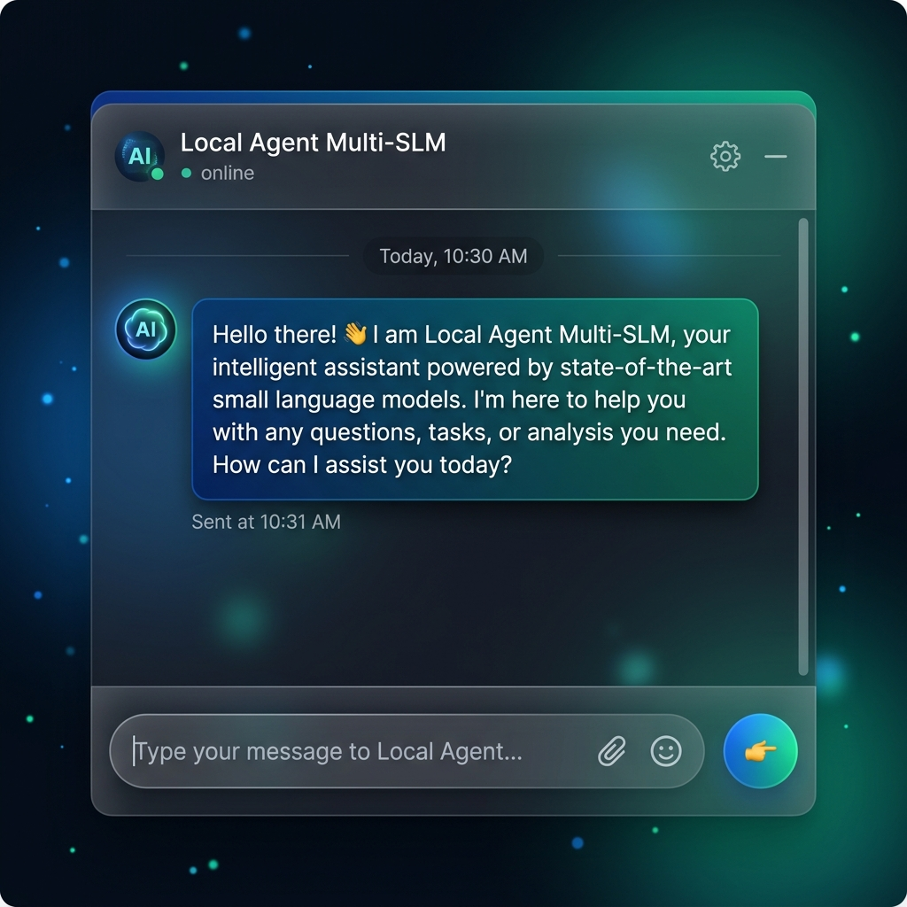
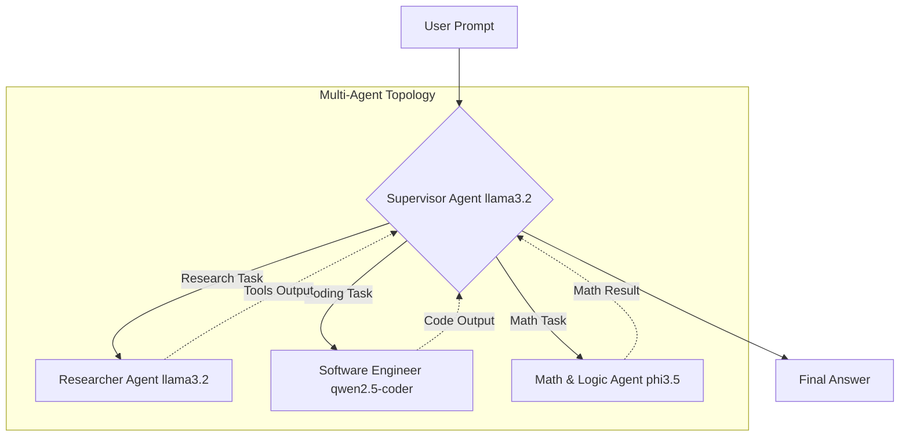

<div align="center">
  <h1>🤖 LocalAgent-SLM</h1>
  <p><b>100% Offline, Privacy-First, Multi-Agent AI System powered by Small Language Models</b></p>

  
  
  
  
</div>

<br/>



Build fully functional, autonomous AI agents that run **entirely on your own hardware**. This project leverages the new generation of compact, highly-efficient Small Language Models (SLMs) to enable reasoning, planning, and task execution on standard laptops—eliminating API costs and ensuring your data never leaves your machine.

---

## ✨ Features

- ⚡ **Lightning Fast Auto-Router**: Bypasses heavy multi-agent loops for simple queries to provide instant responses (under 3 seconds).
- 🧠 **Hierarchical Multi-Agent Crew**: A Supervisor agent dynamically assigns complex tasks to specialized agents (Researchers, Coders, Mathematicians).
- 🛠️ **Slash Commands**: Take direct control with interactive chat commands (`/code`, `/math`, `/deep`) for zero-latency specialized outputs.
- 🎨 **Premium UI**: A beautiful, glassmorphism-themed chat interface with real-time markdown rendering.

---

## 🚀 Quick Start Guide

<details open>
<summary><b>1. Install Ollama & Pull Models</b></summary>
<br/>
You need the Ollama engine to run models locally. Download it from <a href="https://ollama.com/">Ollama.com</a>. Once installed, open a terminal and pull our default specialist models:

```bash
ollama pull llama3.2        # For the Manager & Researcher Agents
ollama pull qwen2.5-coder   # For the Software Engineer Agent
ollama pull phi3.5          # For the Math & Logic Agent
```
</details>

<details open>
<summary><b>2. Install Dependencies</b></summary>
<br/>
Clone this repository and install the required Python packages in your environment:

```bash
pip install -r requirements.txt
```
</details>

<details open>
<summary><b>3. Boot the Server</b></summary>
<br/>
Start the lightning-fast backend API using Uvicorn:

```bash
uvicorn backend.main:app --reload --host 0.0.0.0 --port 8000
```
Open your browser and navigate to: **[http://localhost:8000](http://localhost:8000)**
</details>

---

## 🎮 Interactive Chat Commands

Don't want to wait for the agents to form a committee? Use these slash commands in the chat UI to instantly route your prompt to a specialized model:

| Command | Action | Model Used |
| :--- | :--- | :--- |
| `/code [prompt]` | Instantly generates high-quality programming scripts | `qwen2.5-coder` |
| `/math [prompt]` | Solves complex logic and mathematical equations | `phi3.5` |
| `/deep [prompt]` | Triggers the full CrewAI Multi-Agent deep research loop | `llama3.2` & others |
| *No command* | Defaults to the blazing fast Auto-Router for instant answers | Auto |

---

## 🏗️ Architecture & LLM Topology

We utilize a **Hierarchical Multi-LLM setup**. Instead of forcing one "jack-of-all-trades" model to do everything, our system delegates tasks to specialized SLMs based on their strengths.



### The Specialist Lineup
*(Easily configurable in `backend/config.py`)*

1. 🦅 **Llama 3.2** (*Supervisor & Researcher*): An incredibly fast, highly capable model optimized for multi-lingual and agentic tasks. It's perfectly suited for orchestrating the crew and finding facts via DuckDuckGo and Wikipedia tools.
2. 💻 **Qwen 2.5 Coder** (*Software Engineer*): The absolute state-of-the-art local coding model. It writes clean, efficient syntax far better than general-purpose SLMs.
3. 🧮 **Phi-3.5** (*Mathematician*): Microsoft's tiny powerhouse, highly optimized for deep logic and mathematics using the custom `numexpr` Math Tool.

---
*Built with ❤️ using FastAPI, CrewAI, and Ollama.*
